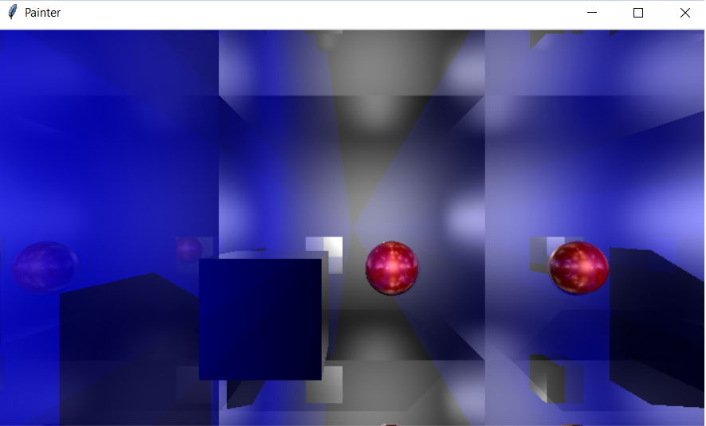
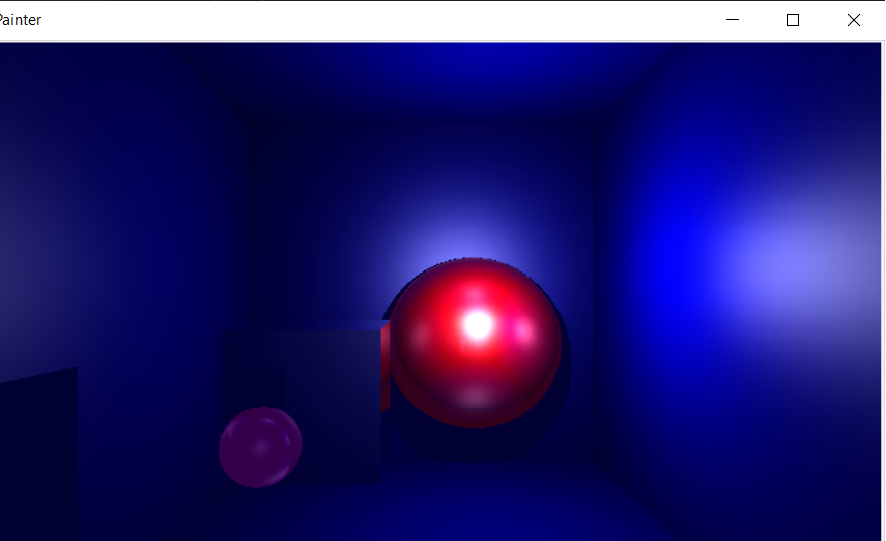
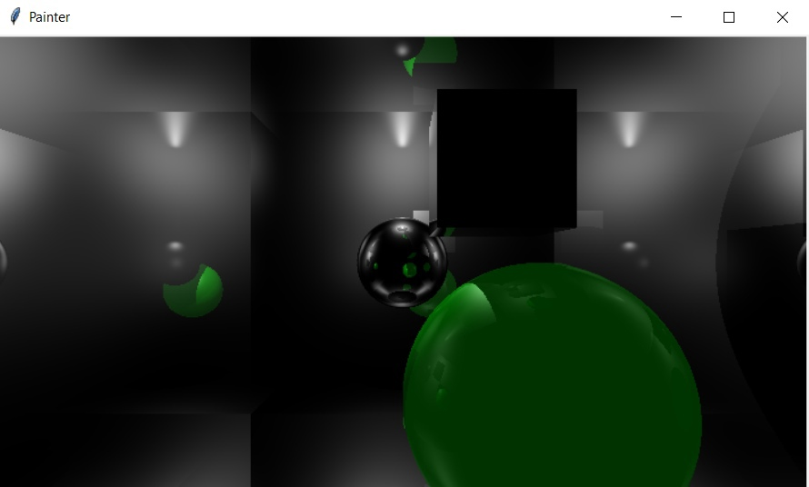

# Реализация простейшего алгоритма рейтрейсинга на языке Python
Проект выполнен в рамках индивидуального задания по университетскому курсу компьютерной графики.

Проект включает себя простой алгоритм трасировки лучей с учётом отражений, на примере простейших фигур (Сфера, Куб, Полигон), алогритм затенения (Блина-Фонга).

Примеры работы программы:

